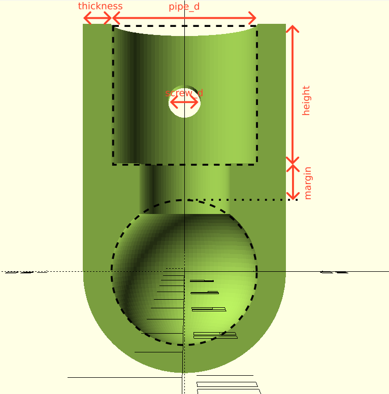

# Ultimate Tube Connector Generator
The Ultimate Tube Connector Generator is an open source project that provides a way to generate parametric connectors to make greenhouses, pipe connectors, or whatever structure you need to build.

|   |   |
|---|---|
|||

## Features
|   |   |   |   |
|---|---|---|---|
|  Multi-arm  |  Safe pipe connectors  | Three hole types  |  Madness allowed  |
|  You can create connectors with as many arms as you want  |  You can create margins to avoid pipes colisions inside the connector   |  You can choose between 3 types of holes: full opened, ringed or closed  |  Create the monster connector that you need in a simple way  |

## Parameters

| Parameter   | Description  | Default value  |
|---|---|---|
| section  | Debugging parameter that allows to see inside the connector  | false  |
| pipe_d  | Inner diameter of the connector arm  | 21  |
| thickness  | Defines the wall thickness  | 4  |
| screw_d  | Screw diameter of every connector arm  | 5  |
| heights  | Vector of arm heights  |   |
| rotationsX  | Vector of arm rotations in x-axis  |   |
| rotationsY  | Vector of arm rotations in y-axis  |   |
| spins  | Vector of arm spins  |   |
| margins  | Vector of arm margins  |   |
| holes  | Vector of arm hole types. Values: 0: Full opened,1: Ring,2: No hole  |   |